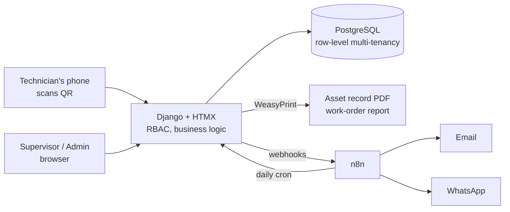

# cmms-saas (working title)

[](https://github.com/Cristhianmancipe96/cmms-saas/actions/workflows/ci.yml)

Multi-tenant CMMS (Computerized Maintenance Management System) for small and mid-size
companies that own machinery but still run maintenance on paper — or not at all — and
need equipment records, preventive schedules and audit-ready evidence (ISO 9001,
Colombian SG-SST, INVIMA/GMP for food packaging).

**Status:** Phase 1 (MVP) built — assets, QR, preventive plans and scheduler, work orders,
PDFs and email, failure requests, audit log, KPI dashboard. See
[docs/briefs/STATUS.md](docs/briefs/STATUS.md) for what has landed, and
[Try it in five minutes](#try-it-in-five-minutes) to see it running with demo data.
**Business model:** monthly subscription per company.

## The problem

Most SMBs have machines, breakdowns and audits — but no equipment records ("hojas de
vida"), no maintenance plan and no evidence when the auditor shows up. Enterprise CMMS
tools are priced per user and designed for maintenance departments, not for a 20-person
plant with one supervisor and two technicians.

## Planned core features (v1)

- **Asset records** — flexible technical sheet per machine (any machine type, JSONB
  specs), photos, manuals, warranty, criticality, full intervention history.
- **QR per asset** — scan the label on the machine and get its live record and
  maintenance status, rendered according to the viewer's role.
- **Preventive maintenance** — calendar-based (weekly / monthly / quarterly / annual)
  and meter-based (usage hours) plans; work orders are auto-generated by an
  **idempotent daily job** (unique constraint on `plan_id + due_date`).
- **Work orders** — state machine (`open → assigned → in_progress → done → verified`),
  digital checklists with frozen snapshots (immutable audit evidence), photo evidence,
  downtime and cost tracking. The executor never verifies their own work.
- **Roles** — admin, supervisor, technician, administrative staff (RBAC).
- **Audit package** — asset record PDF, annual maintenance schedule, history and KPI
  report, one click.
- **KPIs in raw SQL** — MTBF, MTTR, availability, PM compliance, backlog, cost per asset.
- **Notifications** — email first; WhatsApp reminders via n8n in Phase 2.

## Architecture



- **Django 5 + HTMX + PostgreSQL** — CRUD-heavy domain; batteries included; dynamic UI
  without a separate JS frontend. Mobile-first templates.
- **Row-level multi-tenancy** — every business table carries `company_id`; global query
  scoping; Postgres RLS considered as future hardening.
- **n8n delivers messages only** — business rules live in Django, covered by pytest.
  If n8n is down, the CMMS still works; only notifications pause.
- **Quality gates** — pytest + factory-boy, GitHub Actions CI, pre-commit with gitleaks
  (secret scanning on every commit).

See [docs/DECISIONS.md](docs/DECISIONS.md) for the decision log (ADRs).

## Try it in five minutes

### 1. From zero to a running server

```bash
docker compose up -d db      # Postgres 16 — no Docker? see "No Docker on your machine?" below
cp .env.example .env         # then fill in SECRET_KEY (and DATABASE_URL if not using Docker)
uv sync
uv run python manage.py migrate
uv run python manage.py seed_demo
uv run python manage.py runserver 0.0.0.0:8000
```

`0.0.0.0` rather than the default: half of this demo happens on a phone, which needs to
reach the machine over the LAN. Put that same address in `SITE_URL` **before** printing
any QR label — the label is a sticker, and a sticker cannot be edited later.

### 2. What `seed_demo` creates

One fictional company — *Empaques La Sabana S.A.S.*, a flexible-packaging plant with two
sites, eight machines and **ninety days of maintenance history**: preventive work orders
closed on time and late, six breakdowns with downtime and cost, an hour meter that climbs,
a backlog of different ages and two failure reports waiting for a decision. That history
is what makes the dashboard show numbers instead of dashes.

Four accounts, one per role. **The passwords are generated on every run and printed once,
in the console** — they are deliberately not in the source code, so the only way to
recover them is to run the command again (which is safe: it re-uses everything and only
renews the passwords).

| Username | Role | What they demo |
|---|---|---|
| `sabana.admin` | Administrador | Equipment, plans, users, audit log |
| `sabana.super` | Supervisor | Assigning, verifying, converting failure reports |
| `sabana.tecnico` | Técnico | The phone: «Mis OTs», checklist, photos, hour meter |
| `sabana.oficina` | Administrativo | Reporting a failure without touching a work order |

The command is **idempotent** (running it twice creates nothing new — the same
`get_or_create` discipline as the scheduler) and it **refuses to run with `DEBUG=False`**
unless you pass `--force`: a demo company inside a customer's database cannot be removed,
because verified work orders and audit rows are immutable by design. All of its data is
invented; the catalogue lives in [`apps/core/demo_data.py`](apps/core/demo_data.py) and a
test reads that file to keep it that way.

It writes no audit rows on purpose — the audit log records what *people* did, and the
screen fills up the moment the demo touches anything.

### 3. The five-minute script

Browser on the laptop, phone in hand, both logged out to start.

| # | ~ | Who | Do this |
|---|---|---|---|
| 1 | 0:30 | `sabana.admin` | Log in → **Tablero**. Six indicators with real numbers. Switch the period, filter by sede. Scroll to the ageing backlog and the cost per machine: *"this is the plant this morning"*. |
| 2 | 0:45 | | **Equipos → FLW-01**. The hoja de vida: technical sheet, plans, hour meter, intervention history. Open **Etiqueta** — that is the sticker that goes on the machine. |
| 3 | 1:00 | phone | Scan that QR **logged out**: only the plate, code and name, nothing else. Log in on the phone as `sabana.tecnico` and scan again: the live record, its open work orders, and the button to report a failure. |
| 4 | 1:30 | `sabana.tecnico` | **Mis OTs** → an overdue one → **Iniciar**. Tick the checklist. Type `8,4` bar on the 5–7 bar item: it turns to **Falla** by itself — the technician records what the gauge says, the product decides what it means. Attach a photo from the camera, then **Terminar** with the downtime and the cost. |
| 5 | 0:45 | `sabana.super` | Open that same OT → **Verificar**. It seals: whoever executed it cannot verify it, and once verified nobody can edit it. Download the report PDF (or email it) — that is the page an auditor asks for. |
| 6 | 0:30 | `sabana.oficina` → `sabana.super` | The office reports a failure from the equipment record. The supervisor converts it into a corrective work order in one click — twice, to show the second click lands on the same OT instead of a duplicate. |

Finish where you started: **Tablero** (the numbers moved) and, as `sabana.admin`,
**Auditoría** — every step of the last five minutes, with who did it and when, in a table
that cannot be edited or deleted.

**The encore, if there is time.** Open **CMP-01** (the compressor, the one machine that is
scheduled by usage rather than by calendar), enter an hour-meter reading 40 h above the
last one, and run `uv run python manage.py generate_work_orders`. A work order appears on
its own: that is the plan doing its job at five in the morning, every day, without anybody
remembering it. Closing an OT on that machine also asks the technician for the hours — the
calendar-scheduled ones do not, because a field that is never relevant is a field people
learn to skip.

**Before you demo, check two things.** That the PDF engine is installed on the machine you
will present from (see *PDFs: WeasyPrint needs system libraries* below) — without it the
buttons in step 5 answer with a Spanish "falta el motor de impresión" message instead of a
document. And that `SITE_URL` points at the address the phone can reach, or the QR in step
3 will resolve to `localhost` on the phone and go nowhere.

## Local development

```bash
uv run pytest -q             # tests
uv run ruff check .          # lint
uv run python manage.py migrate
uv run python manage.py runserver
```

### Tests and the clock

`TIME_ZONE` is `America/Bogota`, five hours behind UTC, so after 19:00 local time the
stored (UTC) timestamp of "today" already reads as tomorrow. Anything that compares a
timestamp against a date — the report's evidence block, PM compliance, "is this work order
overdue?" — is wrong by a day inside that window if it reads the wrong clock, and a test
that builds its expectation with a bare `.strftime()` passes for nineteen hours a day and
then reddens a build at night.

So the suite pins the clock instead of hoping. `time-machine` is a dev dependency, and
`apps/reports/tests/test_documents.py::NightShiftTests` runs the document assertions at
**20:30 in Bogotá** — 01:30 UTC the next day. Rule of thumb when writing a new test: never
`.strftime()` or `.date()` a stored datetime; go through `timezone.localtime(...)` /
`timezone.localdate()`, which is what the templates' `|date:` filter does.

The end-to-end smoke test — `apps/core/tests/test_golden_path.py` — walks the whole demo
story through the HTTP client in one test, naming each step. If a change breaks any link
in that chain, the failure says which one.

### PDFs: WeasyPrint needs system libraries

The two audit documents (hoja de vida, informe de OT) are rendered by
[WeasyPrint](https://weasyprint.org), which draws text through **Pango/HarfBuzz** — C
libraries, not Python wheels. `uv sync` installs the Python package; the native side has
to come from the operating system:

- **Linux (CI and production):** `sudo apt-get install -y libpango-1.0-0 libpangoft2-1.0-0 libharfbuzz-subset0`
- **macOS:** `brew install pango`
- **Windows:** install the
  [GTK3 runtime](https://github.com/tschoonj/GTK-for-Windows-Runtime-Environment-Installer/releases)
  (add it to `PATH`) and reopen the terminal.

Without them the app still runs and every other feature works: the PDF buttons answer
with a Spanish "falta el motor de impresión en el servidor" message instead of a 500, and
`apps/reports/tests/test_pdf_output.py` skips itself with the same explanation. Check
with:

```bash
uv run python -c "from apps.reports import pdf; print(pdf.engine_available())"
```

### Email

"Enviar por correo" and the invitation that carries a new user's temporary password both
go through Django's SMTP backend, configured by `EMAIL_*` in `.env` (see
`.env.example`). Left unset, mail is printed to the console instead of sent — handy in
development, and never silent. Every attempt, successful or not, writes a row in
`notification_log`.

### The KPI dashboard

`/tablero/` answers the six questions an auditor asks — availability, PM compliance,
MTBF, MTTR, overdue backlog and cost per asset — with **hand-written SQL**, one
statement per indicator in [`apps/kpis/queries.py`](apps/kpis/queries.py). It is the
only module in the product allowed near a cursor (everything else is the ORM), so the
guarantees the ORM gives for free are asserted by hand and tested: every value is a
bound parameter, every statement carries `company_id = %s`, every ratio divides
through `NULLIF`. [docs/kpis.md](docs/kpis.md) states each formula and what it leaves
out; `apps/kpis/tests/scenario.py` is one month of a plant with every number computed
by hand, which is what the tests assert against.

### Scheduling the daily job

Preventive work orders are created by a management command, not by a background worker:

```bash
uv run python manage.py generate_work_orders          # what is due today or overdue
uv run python manage.py generate_work_orders --horizon 7   # plus the next 7 days
```

It is idempotent (`UNIQUE(plan_id, due_date)` + `get_or_create`), so running it twice —
or retrying after a crash — creates nothing new. Run it once a day, early:

**Linux / macOS (cron), 05:00 every day.** `crontab -e`, then:

```bash
0 5 * * * cd /srv/cmms-saas && /usr/local/bin/uv run python manage.py generate_work_orders >> /var/log/cmms/scheduler.log 2>&1
```

**Windows (Task Scheduler), 05:00 every day.** In an elevated PowerShell:

```bash
schtasks /Create /TN "CMMS generate_work_orders" /SC DAILY /ST 05:00 /TR "cmd /c cd /d C:\ruta\cmms-saas && uv run python manage.py generate_work_orders"
```

Both print one line per company plus a total (`plans evaluated / created /
skipped-existing`); that summary is what brief 08 forwards to n8n.

### No Docker on your machine?

SQLite is not an option, not even for tests — create a free
Postgres instance at [neon.tech](https://neon.tech) or [supabase.com](https://supabase.com)
and point `DATABASE_URL` in `.env` at it instead of `docker compose`'s `db` service. On
Supabase specifically, use the **session pooler** connection string (`*.pooler.supabase.com`,
port 5432), not the direct one — the direct host is IPv6-only and unreachable from
IPv4-only networks.

## Deploying to a public URL

The five-minute script above is worth much more from a phone that is not on the office
wifi — which needs a public HTTPS address, not `localhost`. The repository ships what that
takes: a production settings profile (`config/settings_prod.py`) that passes
`manage.py check --deploy` with zero warnings and cannot be started with `DEBUG=True`, a
`Dockerfile` that migrates and then serves through gunicorn with WhiteNoise, and backup
and restore scripts that CI exercises on every push.

```bash
docker build -t vectron:latest .
```

**[docs/deploy.md](docs/deploy.md)** is the checklist: every environment variable and what
breaks without it, Railway and VPS paths, domain and HTTPS, a five-step smoke test on the
deployed URL, how to restore a backup, and an honest list of what this deployment does not
do yet.

## Roadmap

| Phase | Scope | Exit criterion |
|---|---|---|
| 0 — Spec & skeleton | Acceptance criteria, data model v1, Django skeleton, CI | `pytest` green on a public repo |
| 1 — MVP | Assets, QR, preventive plans, work orders, PDFs, email | Pilot company runs a real work order from a phone |
| 2 — Audit & numbers | KPI dashboard (raw SQL), annual schedule, audit package, n8n + WhatsApp | Full audit package in one click |
| 3 — SaaS | Self-service signup, monthly billing, plan limits, landing | First external company pays |
| 4 — AI layer | RAG over machine manuals (pgvector), root-cause hints, MCP server | — |

## License

No open-source license (all rights reserved). The code is public as build-in-public
evidence; it is not free to redistribute or resell. A source-available license may be
evaluated later.

## Author

Cristhian Mancipe — mechatronics engineer, Bogotá. Building LLM-era automation systems
in production (WhatsApp sales agent with real transactions, offline eval harness,
cost-per-conversation economics).
