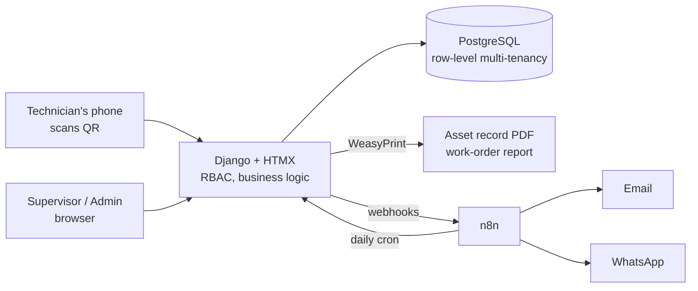

# cmms-saas (working title)

[](https://github.com/Cristhianmancipe96/cmms-saas/actions/workflows/ci.yml)

Multi-tenant CMMS (Computerized Maintenance Management System) for small and mid-size
companies that own machinery but still run maintenance on paper — or not at all — and
need equipment records, preventive schedules and audit-ready evidence (ISO 9001,
Colombian SG-SST, INVIMA/GMP for food packaging).

**Status:** spec phase (Phase 0). Built in public as a portfolio + commercial project.
**Business model:** monthly subscription per company.

## The problem

Most SMBs have machines, breakdowns and audits — but no equipment records ("hojas de
vida"), no maintenance plan and no evidence when the auditor shows up. Enterprise CMMS
tools are priced per user and designed for maintenance departments, not for a 20-person
plant with one supervisor and two technicians.

## Planned core features (v1)

- **Asset records** — flexible technical sheet per machine (any machine type, JSONB
  specs), photos, manuals, warranty, criticality, full intervention history.
- **QR per asset** — scan the label on the machine and get its live record and
  maintenance status, rendered according to the viewer's role.
- **Preventive maintenance** — calendar-based (weekly / monthly / quarterly / annual)
  and meter-based (usage hours) plans; work orders are auto-generated by an
  **idempotent daily job** (unique constraint on `plan_id + due_date`).
- **Work orders** — state machine (`open → assigned → in_progress → done → verified`),
  digital checklists with frozen snapshots (immutable audit evidence), photo evidence,
  downtime and cost tracking. The executor never verifies their own work.
- **Roles** — admin, supervisor, technician, administrative staff (RBAC).
- **Audit package** — asset record PDF, annual maintenance schedule, history and KPI
  report, one click.
- **KPIs in raw SQL** — MTBF, MTTR, availability, PM compliance, backlog, cost per asset.
- **Notifications** — email first; WhatsApp reminders via n8n in Phase 2.

## Architecture



- **Django 5 + HTMX + PostgreSQL** — CRUD-heavy domain; batteries included; dynamic UI
  without a separate JS frontend. Mobile-first templates.
- **Row-level multi-tenancy** — every business table carries `company_id`; global query
  scoping; Postgres RLS considered as future hardening.
- **n8n delivers messages only** — business rules live in Django, covered by pytest.
  If n8n is down, the CMMS still works; only notifications pause.
- **Quality gates** — pytest + factory-boy, GitHub Actions CI, pre-commit with gitleaks
  (secret scanning on every commit).

See [docs/DECISIONS.md](docs/DECISIONS.md) for the decision log (ADRs).

## Local development

```bash
docker compose up -d db      # Postgres 16 — no Docker? see below
cp .env.example .env         # then fill in SECRET_KEY (and DATABASE_URL if not using Docker)
uv sync
uv run python manage.py migrate
uv run pytest -q             # tests
uv run ruff check .          # lint
uv run python manage.py runserver
```

### PDFs: WeasyPrint needs system libraries

The two audit documents (hoja de vida, informe de OT) are rendered by
[WeasyPrint](https://weasyprint.org), which draws text through **Pango/HarfBuzz** — C
libraries, not Python wheels. `uv sync` installs the Python package; the native side has
to come from the operating system:

- **Linux (CI and production):** `sudo apt-get install -y libpango-1.0-0 libpangoft2-1.0-0 libharfbuzz-subset0`
- **macOS:** `brew install pango`
- **Windows:** install the
  [GTK3 runtime](https://github.com/tschoonj/GTK-for-Windows-Runtime-Environment-Installer/releases)
  (add it to `PATH`) and reopen the terminal.

Without them the app still runs and every other feature works: the PDF buttons answer
with a Spanish "falta el motor de impresión en el servidor" message instead of a 500, and
`apps/reports/tests/test_pdf_output.py` skips itself with the same explanation. Check
with:

```bash
uv run python -c "from apps.reports import pdf; print(pdf.engine_available())"
```

### Email

"Enviar por correo" and the invitation that carries a new user's temporary password both
go through Django's SMTP backend, configured by `EMAIL_*` in `.env` (see
`.env.example`). Left unset, mail is printed to the console instead of sent — handy in
development, and never silent. Every attempt, successful or not, writes a row in
`notification_log`.

### Scheduling the daily job

Preventive work orders are created by a management command, not by a background worker:

```bash
uv run python manage.py generate_work_orders          # what is due today or overdue
uv run python manage.py generate_work_orders --horizon 7   # plus the next 7 days
```

It is idempotent (`UNIQUE(plan_id, due_date)` + `get_or_create`), so running it twice —
or retrying after a crash — creates nothing new. Run it once a day, early:

**Linux / macOS (cron), 05:00 every day.** `crontab -e`, then:

```bash
0 5 * * * cd /srv/cmms-saas && /usr/local/bin/uv run python manage.py generate_work_orders >> /var/log/cmms/scheduler.log 2>&1
```

**Windows (Task Scheduler), 05:00 every day.** In an elevated PowerShell:

```bash
schtasks /Create /TN "CMMS generate_work_orders" /SC DAILY /ST 05:00 /TR "cmd /c cd /d C:\ruta\cmms-saas && uv run python manage.py generate_work_orders"
```

Both print one line per company plus a total (`plans evaluated / created /
skipped-existing`); that summary is what brief 08 forwards to n8n.

No Docker on your machine? SQLite is not an option, not even for tests — create a free
Postgres instance at [neon.tech](https://neon.tech) or [supabase.com](https://supabase.com)
and point `DATABASE_URL` in `.env` at it instead of `docker compose`'s `db` service. On
Supabase specifically, use the **session pooler** connection string (`*.pooler.supabase.com`,
port 5432), not the direct one — the direct host is IPv6-only and unreachable from
IPv4-only networks.

## Roadmap

| Phase | Scope | Exit criterion |
|---|---|---|
| 0 — Spec & skeleton | Acceptance criteria, data model v1, Django skeleton, CI | `pytest` green on a public repo |
| 1 — MVP | Assets, QR, preventive plans, work orders, PDFs, email | Pilot company runs a real work order from a phone |
| 2 — Audit & numbers | KPI dashboard (raw SQL), annual schedule, audit package, n8n + WhatsApp | Full audit package in one click |
| 3 — SaaS | Self-service signup, monthly billing, plan limits, landing | First external company pays |
| 4 — AI layer | RAG over machine manuals (pgvector), root-cause hints, MCP server | — |

## License

No open-source license (all rights reserved). The code is public as build-in-public
evidence; it is not free to redistribute or resell. A source-available license may be
evaluated later.

## Author

Cristhian Mancipe — mechatronics engineer, Bogotá. Building LLM-era automation systems
in production (WhatsApp sales agent with real transactions, offline eval harness,
cost-per-conversation economics).
